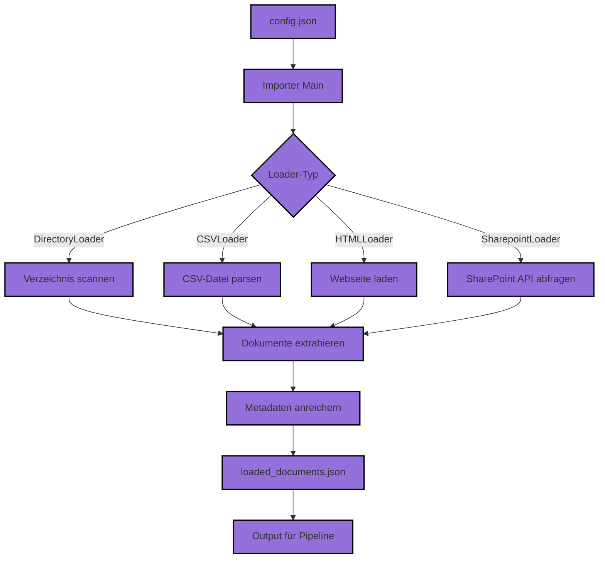

# Learn2RAG importer

This application is an importer for data that is to be used within the learn2rag pipeline application

Author: IFDT, KM
Version: 0.0.4


## Installation
    
- to better determine filetypes, make sure all requirements are met
- install dependencies
```
apt install libgl1 libmagic1
```
- install magic1.dll if you are using windows

- install libmagic on MacOS (with Homebrew)
```
brew install libmagic
```

## Architecture




## Configuration
- change /config/config.json according to your needs. Add a entry for each loader that you want to configure (see examples)
- Basic Structure for the config.json is  

```
{
    "loaders": [
        {
            "loader_type": "[TYPE_OF_LOADER]",
            [options_for the loader]
        },
        {
            "loader_type": "[TYPE_OF_LOADER]",
            [options_for the loader]
        },
        {
            ...
        }
    ]
}   
```

## Verfügbare Loader
Der Importer unterstützt die folgenden Loader-Typen:

- **DirectoryLoader**: Lädt Dokumente aus einem Verzeichnis, unterstützt verschiedene Dateiformate (.csv, .doc, .docx, .eml, .epub, .html, .json, .md, .odt, .pdf, .ppt, .pptx, .rst, .rtf, .txt, .tsv, .cls, .xlsx, .xml)
- **CSVLoader**: Lädt Dokumente aus CSV-Dateien, jede Zeile wird als separates Dokument behandelt
- **HTMLLoader**: Lädt Inhalte von Webseiten, kann rekursiv Links folgen
- **SharepointLoader**: Lädt Dokumente aus SharePoint-Dokumentbibliotheken mit App-Only-Authentifizierung

## Output
- output will be produced as json in the main directory in loaded_documents.json

### Example Config and Result for DirectoryLoader
DirectoryLoader will parse configured directories for files that can be mapped to a text input. 
Currently processed files are: .csv, doc, docx, .eml, epub, html, json, md, odt, .pdf, ppt, pptx, .rst, .rtf, .txt, .tsv, .cls, .xlsx, .xml

To config a directory, add to the config.json a section und "loaders" like

```
 {
   "loader_type": "DirectoryLoader",
   "path": "C:\\Users\\foo",
   "recursive": "True"
 },
```

where 
- "loader_type" is set to "DirectoryLoader" to specify the use of the DirectoryLoader
- "path" is set to the Directory in the filesystem that is to be processed
- "recursive" can be set to "True" or "False" and will specifiy whether to process all subdirectories of the given directory

All results will be written to the the loaded_documents.json for each File in the path an entry like this will be generated 

```
{
    "metadata": {
        "source": "C:C:\\Users\\foo\\Revised Manuscript_Text categorization approach.docx",
        "content_hash": "e18e509d138cf86c22df0b0dfafc5ca5b8f1e266f5e3470de68190f3ebe495b0",
        "source_path": "C:\\Users\\foo",
        "file_extension": "docx",
        "process_date": "2025-07-28",
        "process_time": "14:42:02",
        "loader_type": "DirectoryLoader"
    },
    "content": "A Corpus-based Real-time Text Classification and Tagging Approach for Social Data..."
},
```

where
- medatdata will contain metadata to the files processed
- content will hold the actual text content of the file

### Example Config and Result for HTMLoader
HTMLoader will parse configured URLs and extract text/metadata of the webpage

To config a URL, add to the config.json a section und "loaders" like

```
 {
   "loader_type": "HTMLLoader",
   "url": "https://learn2rag.de",
   "depth": 0
 },
```

where 
- "loader_type" is set to "HTMLLoader" to specify the use of the HTMLLoader
- "url" is set to the URL of where the webpage can be found
- "depth" whether to process pages that are linked on the page to the depth of x. 0 means to do not process links, 1 will process all links directly found on the page, 2 will process links found in linked pages and so on. Each page is processed only once even if linked multiple times.

All results will be written to the the loaded_documents.json for each File in the path an entry like this will be generated 

```
 {
        "metadata": {
            "source": "https://learn2rag.de",
            "content_hash": "ad31e0478b3390eb4425c5b26d41c8677f79e70b6a9c1021256c04b1db091636",
            "process_date": "2025-07-28",
            "process_time": "14:42:02",
            "loader_type": "HTMLLoader",
            "meta_properties": {
                "description": "Website",
                "og:type": "website",
                "og:locale": "de_DE",
                "og:site_name": "Learn2RAG",
                "og:title": "Learn2RAG",
                "og:url": "https://learn2rag.de//",
                "og:description": "Website",
                "og:image": "https://learn2rag.de//assets/images/Learn2RAG_Header.png",
                "viewport": "width=device-width, initial-scale=1.0"
            }
        },
        "content": "\n\nWorkshops 2025\n\nIm September und Oktober 2025 organisieren wir Workshops zum Thema RAG. Mehr dazu hier\n\nIn der heutigen schnelllebigen Geschäftswelt sind Unternehmen und öffentliche Einrichtungen gefordert, ihre Daten effizient zu nutzen, um w..."
    }
```

where
- medatdata will contain metadata to the pages processed
    - mata_properties will hold all meta_tags set in the webpage itself
- content will hold the actual text content of the page as text

### Example Config and Result for CSVLoader
CSVLoader lädt Dokumente aus CSV-Dateien und extrahiert den Inhalt jeder Zeile als separates Dokument.

Um eine CSV-Datei zu konfigurieren, fügen Sie der config.json einen Abschnitt unter "loaders" hinzu:

```
 {
   "loader_type": "CSVLoader",
   "path": "C:\\Users\\foo\\data.csv"
 },
```

wo
- "loader_type" auf "CSVLoader" gesetzt ist, um die Verwendung des CSVLoaders anzugeben
- "path" auf den Pfad zur CSV-Datei im Dateisystem gesetzt ist

Alle Ergebnisse werden in die loaded_documents.json geschrieben. Für jede Zeile in der CSV-Datei wird ein Eintrag wie folgt generiert:

```
{
    "metadata": {
        "source": "C:\\Users\\foo\\data.csv",
        "loader_type": "CSVLoader",
        "file_name": "data.csv",
        "file_extension": "csv",
        "row": 1
    },
    "content": "Spalte1: Wert1, Spalte2: Wert2, ..."
},
```

wo
- metadata Metadaten zur Datei und Zeile enthält
- content den extrahierten Textinhalt der Zeile hält

### Example Config and Result for SharepointLoader
SharepointLoader lädt Dokumente aus einer SharePoint-Dokumentbibliothek unter Verwendung von App-Only-Authentifizierung.

Um SharePoint zu konfigurieren, fügen Sie der config.json einen Abschnitt unter "loaders" hinzu:

```
 {
   "loader_type": "SharepointLoader",
   "client_id": "your-client-id",
   "client_secret": "your-client-secret",
   "tenant_id": "your-tenant-id",
   "document_library_id": "your-document-library-id",
   "folder_path": "/path/to/folder",
   "recursive": true
 },
```

wo
- "loader_type" auf "SharepointLoader" gesetzt ist
- "client_id", "client_secret", "tenant_id" die Authentifizierungsdaten sind
- "document_library_id" die ID der Dokumentbibliothek
- "folder_path" der Pfad zum Ordner (optional)
- "recursive" angibt, ob Unterordner durchsucht werden sollen

Zusätzlich zu den erforderlichen Parametern unterstützt der SharepointLoader mehrere optionale Parameter:

- "folder_id": Die ID eines spezifischen Ordners in der Dokumentbibliothek, von dem aus geladen werden soll (alternative zu folder_path)
- "object_ids": Eine Liste von spezifischen Objekt-IDs, die geladen werden sollen (z. B. einzelne Dateien)
- "recursive": Boolescher Wert (true/false), ob Unterordner rekursiv durchsucht werden sollen (Standard: false)
- "auth_with_token": Boolescher Wert (true/false), ob ein gespeichertes Token für die Authentifizierung verwendet werden soll (Standard: true)
- "reset_token": Boolescher Wert (true/false), ob das gespeicherte Token zurückgesetzt werden soll (z. B. bei Ablauf, Standard: false)
- "tenant_id": Die Tenant-ID für die Authentifizierung (Standard: "common")
- "site_id": Die ID einer spezifischen SharePoint-Site (optional, falls nicht die Root-Site verwendet wird)

Alle Ergebnisse werden in die loaded_documents.json geschrieben. Für jede Datei wird ein Eintrag generiert, ähnlich wie bei DirectoryLoader.

Beispiel-Output für SharepointLoader:

```
{
    "metadata": {
        "source": "https://mysharepointserver.sharepoint.com/sites/examples/_layouts/15/Doc.aspx?sourcedoc=%01XXXXBDTXXXX&file=Aufteilung%20Reisetypen.docx&action=default&mobileredirect=true",
        "sharepoint_id": "01XXXXBDTXXXX",
        "name": "Aufteilung Reisetypen.docx",
        "created": "2024-09-26 09:13:40+02:00",
        "modified": "2024-09-26 09:13:40+02:00",
        "loader_type": "SharepointLoader"
    },
    "content": "Es fallen zu verschiedenen Zwecken Reisen an, die in 4 Typen gegliedert werden können. Diese werden im Folgenden erläutert:..."
},
```

wo
- metadata Metadaten zur SharePoint-Datei enthält, einschließlich ID, Name, Erstellungs- und Änderungsdatum
- content den extrahierten Textinhalt der Datei hält

### Sharepoint Loader Prerequisites

Prerequisites

    Register an application with the Microsoft identity platform instructions.
    When registration finishes, the Azure portal displays the app registration’s Overview pane. You see the Application (client) ID. Also called the client ID, this value uniquely identifies your application in the Microsoft identity platform.
    During the steps you will be following at item 1, you can set the redirect URI as https://login.microsoftonline.com/common/oauth2/nativeclient
    During the steps you will be following at item 1, generate a new password (client_secret) under Application Secrets section.
    Follow the instructions at this document to add the following SCOPES (offline_access and Sites.Read.All) to your application.
    To retrieve files from your Document Library, you will need its ID. To obtain it, you will need values of Tenant Name, Collection ID, and Subsite ID.
    To find your Tenant Name follow the instructions at this document. Once you got this, just remove .onmicrosoft.com from the value and hold the rest as your Tenant Name.
    To obtain your Collection ID and Subsite ID, you will need your SharePoint site-name. Your SharePoint site URL has the following format https://<tenant-name>.sharepoint.com/sites/<site-name>. The last part of this URL is the site-name.
    To Get the Site Collection ID, hit this URL in the browser: https://<tenant>.sharepoint.com/sites/<site-name>/_api/site/id and copy the value of the Edm.Guid property.
    To get the Subsite ID (or web ID) use: https://<tenant>.sharepoint.com/sites/<site-name>/_api/web/id and copy the value of the Edm.Guid property.
    The SharePoint site ID has the following format: <tenant-name>.sharepoint.com,<Collection ID>,<subsite ID>. You can hold that value to use in the next step.
    Visit the Graph Explorer Playground to obtain your Document Library ID. The first step is to ensure you are logged in with the account associated with your SharePoint site. Then you need to make a request to https://graph.microsoft.com/v1.0/sites/<SharePoint site ID>/drive and the response will return a payload with a field id that holds the ID of your Document Library ID.

  


## Changelog
- v0.0.1
  - initial testing release, allows to import files from a directory (DirectoryLoader)
- v0.0.2
  - added import of Webpages (HTMLReader)
- v0.0.3
  - added content hash for HTMLReader and config examples
- v0.0.4
  - updated dependencies
  - better ouput description for files loaded
  - fixed error if only HTMLLoader is used
- v0.0.5
  - removed keyboard monitoring, since not running interactive mode
  - changed to relative path config
  - supress magic warning
  - added permission info for metadata in directory loader
- v0.0.6
  - removed permission information from metadata in directory loader
  - added SharePoint Loader
- v0.0.7
  - added type checks