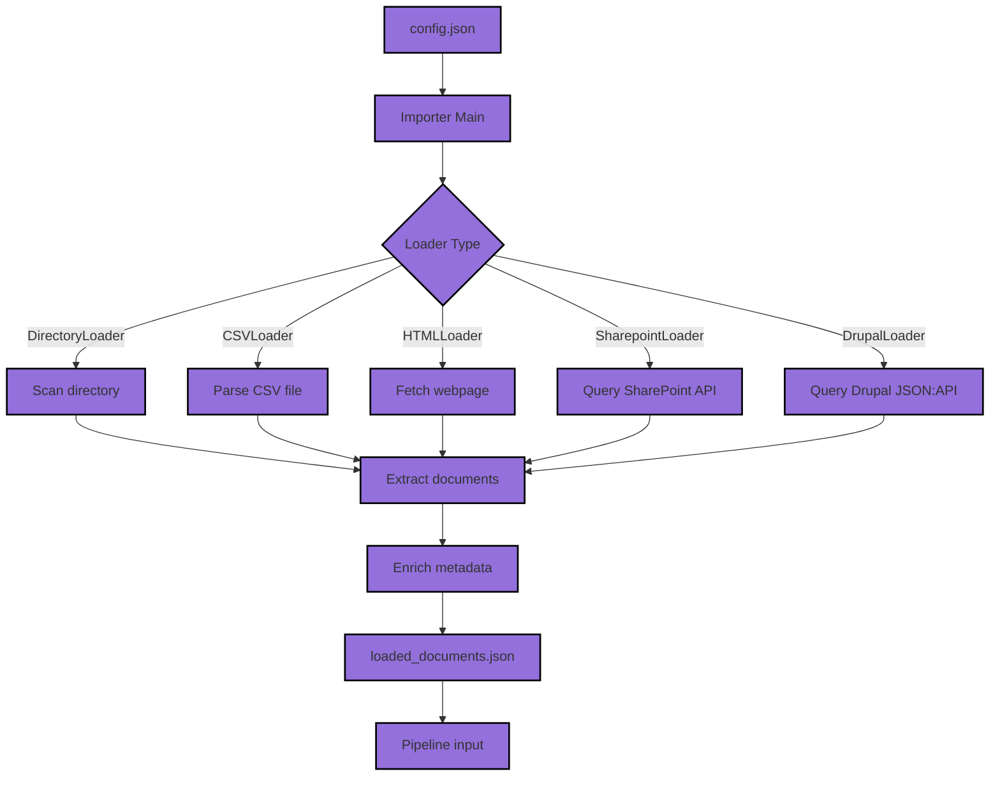

# Learn2RAG Importer

An importer for document sources used within the Learn2RAG pipeline. It reads a `config.json`, delegates loading to the appropriate loader, enriches documents with metadata, and writes results to `loaded_documents.json`.

**Author:** IFDT, KM  
**Version:** 0.0.5

---

## Installation

Install system dependencies required for file type detection and document parsing:

**Linux**
```bash
apt install libgl1 libmagic1
```

**Windows**  
Install `magic1.dll` manually and add it to your PATH.

**macOS**
```bash
brew install libmagic
```

Install Python dependencies via Poetry:
```bash
poetry install
```

---

## Architecture



---

## Running the importer

```bash
python -m learn2rag.importer
```

---

## Configuration

Edit `config/config.json` to define one or more loaders. Each entry requires at minimum a `loader_type` and a `loader_id`. Multiple loaders of different types can be combined freely.

```json
{
    "loaders": [
        {
            "loader_type": "<LOADER_TYPE>",
            "loader_id": "<UNIQUE_ID>",
            ...loader-specific options...
        }
    ]
}
```

> **Note:** `loader_id` is strongly recommended. It is added to the metadata of every document produced by that loader and makes it easy to trace documents back to their source configuration.

---

## Output

Results are written to `loaded_documents.json` in the project root. Each document entry contains a `metadata` object and a `content` string:

```json
[
    {
        "metadata": {
            "source": "<origin URL or file path>",
            "loader_id": "<your loader_id>",
            "content_hash": "<sha256 of content>",
            ...additional fields depending on loader...
        },
        "content": "The extracted plain text content of the document."
    }
]
```

---

## Available Loaders

### DirectoryLoader

Scans a local directory for supported files and extracts their text content.

**Supported file types:** `.docx`, `.pptx`, `.xlsx`, `.pdf`, `.txt`, `.csv`, `.html`, `.md`, `.rtf`, `.odt`, `.epub`,

> Pandoc is required for some file types - if not present user is informed and system will try to install interactivly

**Configuration:**

```json
{
    "loader_type": "DirectoryLoader",
    "loader_id": "my_docs",
    "path": "C:\\Users\\foo\\documents",
    "recursive": "True",
    "silent_errors": "True"
}
```

| Parameter | Required | Description |
|---|---|---|
| `path` | yes | Absolute path to the directory to scan |
| `recursive` | yes | `"True"` to include subdirectories, `"False"` for top-level only |
| `silent_errors` | no | `"True"` (default) skips unreadable files silently; `"False"` raises errors and will interupt loader|

**Example output entry:**

```json
{
    "metadata": {
        "source": "C:\\Users\\foo\\documents\\report.docx",
        "loader_id": "my_docs",
        "content_hash": "e18e509d138cf86c22df0b0dfafc5ca5b8f1e266f5e3470de68190f3ebe495b0",
        "source_path": "C:\\Users\\foo\\documents",
        "file_extension": "docx",
        "process_date": "2026-03-17",
        "process_time": "14:42:02",
        "loader_type": "DirectoryLoader"
    },
    "content": "Executive Summary ..."
}
```

---

### CSVLoader

Loads a CSV file where each row becomes a separate document.

**Configuration:**

```json
{
    "loader_type": "CSVLoader",
    "loader_id": "product_catalog",
    "path": "C:\\data\\products.csv"
}
```

| Parameter | Required | Description |
|---|---|---|
| `path` | yes | Absolute path to the CSV file |

**Example output entry:**

```json
{
    "metadata": {
        "source": "C:\\data\\products.csv",
        "loader_id": "product_catalog",
        "loader_type": "CSVLoader",
        "process_date": "2026-03-17",
        "process_time": "09:00:00"
    },
    "content": "row: 1 | name: Widget A | price: 9.99 | ..."
}
```

---

### HTMLLoader

Fetches a web page and extracts its text content. Optionally follows links recursively.

**Configuration:**

```json
{
    "loader_type": "HTMLLoader",
    "loader_id": "company_website",
    "url": "https://www.example.com",
    "depth": 1
}
```

| Parameter | Required | Description |
|---|---|---|
| `url` | yes | The URL of the page to load |
| `depth` | no | Link traversal depth (default `0`). `0` = only the given page, `1` = also follow all direct links, `2` = follow links on linked pages, etc. Each URL is only loaded once. |

**Example output entry:**

```json
{
    "metadata": {
        "source": "https://www.example.com/about",
        "loader_id": "company_website",
        "content_hash": "a1b2c3...",
        "process_date": "2026-03-17",
        "process_time": "10:15:00"
    },
    "content": "About us – Example Company was founded in ..."
}
```

---

### SharepointLoader

Loads documents from a SharePoint document library using App-Only authentication (client credentials).

**Prerequisites:**
1. Register an Azure AD app with `Sites.Read.All` permission (application permission, not delegated).
2. Grant admin consent for the permission.
3. Note down the `client_id`, `client_secret`, `tenant_id`, and `document_library_id`.

**Configuration:**

```json
{
    "loader_type": "SharepointLoader",
    "loader_id": "sp_policies",
    "client_id": "xxxxxxxx-xxxx-xxxx-xxxx-xxxxxxxxxxxx",
    "client_secret": "your-client-secret",
    "tenant_id": "xxxxxxxx-xxxx-xxxx-xxxx-xxxxxxxxxxxx",
    "document_library_id": "xxxxxxxx-xxxx-xxxx-xxxx-xxxxxxxxxxxx",
    "site_id": "xxxxxxxx-xxxx-xxxx-xxxx-xxxxxxxxxxxx",
    "folder_path": "/General/Policies",
    "recursive": "True",
    "auth_with_token": "False",
    "reset_token": "False"
}
```

| Parameter | Required | Description |
|---|---|---|
| `client_id` | yes | Azure AD application client ID |
| `client_secret` | yes | Azure AD application client secret |
| `tenant_id` | yes | Azure AD tenant ID |
| `document_library_id` | yes | SharePoint document library ID |
| `site_id` | no | SharePoint site ID (required for site-specific access) |
| `folder_path` | no | Relative path within the library to restrict loading |
| `folder_id` | no | Folder ID (alternative to `folder_path`) |
| `object_ids` | no | List of specific file object IDs to load |
| `recursive` | no | `"True"` to include subfolders (default `"False"`) |
| `auth_with_token` | no | Use cached token instead of client credentials (default `"False"`) |
| `reset_token` | no | Force re-authentication and discard cached token (default `"False"`) |

**Example output entry:**

```json
{
    "metadata": {
        "source": "https://contoso.sharepoint.com/sites/HR/Policies/leave-policy.pdf",
        "loader_id": "sp_policies",
        "content_hash": "d3f1a2...",
        "file_name": "leave-policy.pdf",
        "file_extension": "pdf"
    },
    "content": "Leave Policy 2026 – Section 1: Annual Leave ..."
}
```

---

### DrupalLoader

Loads content nodes from a Drupal 8/9/10/11 site via the built-in JSON:API module. Endpoint URLs are auto-discovered from the JSON:API index, so language-prefixed paths (e.g. `/en/jsonapi/`) are handled automatically.

**Prerequisites:**
- The **JSON:API** core module must be enabled in Drupal (`Extend` → JSON:API).
- The content types to be loaded must be accessible (check permissions under `People` → `Permissions` → JSON:API).

**Configuration:**

```json
{
    "loader_type": "DrupalLoader",
    "loader_id": "drupal_main",
    "base_url": "https://your-drupal-site.example.com",
    "content_types": ["article", "page"],
    "text_fields": ["title", "field_body", "body"],
    "auth_type": "basic",
    "username": "api-user",
    "password": "secret",
    "language": "en",
    "page_size": 50
}
```

| Parameter | Required | Description |
|---|---|---|
| `base_url` | yes | Base URL of the Drupal site (without trailing slash) |
| `content_types` | yes | List of content type machine names to import, e.g. `["article", "page"]` |
| `text_fields` | no | Fields to use as document text content. Defaults to `["title", "field_body", "body"]`. Run the importer once and check the log for `available non-null attribute fields` to find the correct field names for your installation. |
| `auth_type` | no | Authentication: `"none"` (default), `"basic"` (username + password), or `"token"` (Bearer token) |
| `username` | no | Username — required when `auth_type` is `"basic"` |
| `password` | no | Password — required when `auth_type` is `"basic"` |
| `token` | no | Bearer token — required when `auth_type` is `"token"` |
| `language` | no | Language filter, e.g. `"en"` or `"de"`. Sets the `Accept-Language` request header. |
| `page_size` | no | Number of nodes per API request (default `50`) |

> **Tip:** If `content` only shows the title, the body field name differs from the default. Check the log output for the line `available non-null attribute fields for '<type>'` and add the correct field name to `text_fields`.

**Example output entry:**

```json
{
    "metadata": {
        "source": "https://your-drupal-site.example.com/node/42",
        "loader_id": "drupal_main",
        "content_type": "article",
        "node_id": "42",
        "title": "Getting started with Drupal",
        "created": "2026-03-15T10:39:51+00:00",
        "changed": "2026-03-15T10:39:51+00:00",
        "langcode": "en",
        "status": true,
        "content_hash": "c8f474..."
    },
    "content": "Getting started with Drupal\n\nDrupal is a flexible CMS ..."
}
```

All results will be written to the the loaded_documents.json for each File in the path an entry like this will be generated 

```
 {
        "metadata": {
            "source": "https://learn2rag.de",
            "content_hash": "ad31e0478b3390eb4425c5b26d41c8677f79e70b6a9c1021256c04b1db091636",
            "process_date": "2025-07-28",
            "process_time": "14:42:02",
            "loader_type": "HTMLLoader",
            "meta_properties": {
                "description": "Website",
                "og:type": "website",
                "og:locale": "de_DE",
                "og:site_name": "Learn2RAG",
                "og:title": "Learn2RAG",
                "og:url": "https://learn2rag.de//",
                "og:description": "Website",
                "og:image": "https://learn2rag.de//assets/images/Learn2RAG_Header.png",
                "viewport": "width=device-width, initial-scale=1.0"
            }
        },
        "content": "\n\nWorkshops 2025\n\nIm September und Oktober 2025 organisieren wir Workshops zum Thema RAG. Mehr dazu hier\n\nIn der heutigen schnelllebigen Geschäftswelt sind Unternehmen und öffentliche Einrichtungen gefordert, ihre Daten effizient zu nutzen, um w..."
    }
```

where
- medatdata will contain metadata to the pages processed
    - mata_properties will hold all meta_tags set in the webpage itself
- content will hold the actual text content of the page as text


## Changelog
- v0.0.1
  - initial testing release, allows to import files from a directory (DirectoryLoader)
- v0.0.2
  - added import of Webpages (HTMLReader)
- v0.0.3
  - added content hash for HTMLReader and config examples
- v0.0.4
  - updated dependencies
  - better ouput description for files loaded
  - fixed error if only HTMLLoader is used
- v0.0.5
  - removed keyboard monitoring, since not running interactive mode
  - changed to relative path config
  - supress magic warning
  - added permission info for metadata in directory loader
- v0.0.6
  - removed permission information from metadata in directory loader
  - added SharePoint Loader
- v0.0.7 
  - added type checks
- v0.0.8
  - added loader_id for all loaders
  - improved error handling and dependency checking for directory loader
  - added drupal_loader
- v0.0.9
  - unified `source` field as document identifier across all loaders in metadata (directory: file path, HTML: URL, SharePoint: web URL, Drupal: node URL, CSV: file path)
  - delta import now uses `get_documents` from the pipeline
  - hash comparison now uses sorted chunk hashes per source for stable results
  - **Breaking change:** Qdrant payload field renamed from `path` → `source`; existing collections must be deleted and re-imported